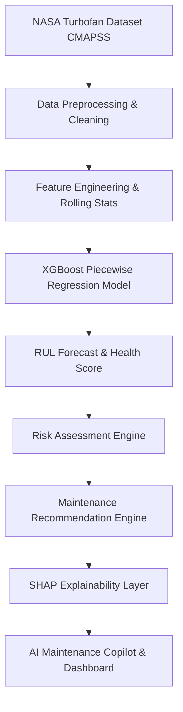

# ✈️ AeroGuard AI – Predictive Maintenance Intelligence Platform

> Transforming Industrial Sensor Data into Intelligent Decisions.

AeroGuard AI is an enterprise-grade decision-support platform designed for aerospace operations, industrial asset management, and airline maintenance engineering teams. Using the **NASA CMAPSS Turbofan Engine Degradation Dataset**, the platform monitors real-time telemetry, forecasts Remaining Useful Life (RUL), runs What-If servicing simulations, explains ML predictions via SHAP, and computes operational/financial business impact.

---

## 🚀 Key Features

* **SaaS Landing Page**: Sleek, dark-mode aerospace landing page featuring a product overview, value proposition, tech stack, and a "Launch Platform" call-to-action.
* **Operations Dashboard (Mission Control)**: Displays real-time aggregates (Average Health, Avg RUL, Critical Assets, Active Services due) with active line plotting and live telemetry streaming simulation.
* **SCHEMATIC Digital Twin**: SVG-based turbofan schematic illustrating low-pressure compressor (LPC), high-pressure compressor (HPC), and low-pressure turbine (LPT) stages with active risk overlays that animate (spin) in proportion to degradation.
* **Prediction Center**: Allows manual intake parameters (Thermal, Speed & Pressure, and Fuel & Coolant groups), "Load Sample Data" presets representing real CMAPSS stages (Healthy, Warning, Critical), and CSV log file uploads.
* **Explainable AI (XAI)**: Predictions are backed by local feature attributions (SHAP) mapped to a horizontal bar chart, complemented by a natural language explanation.
* **AI Maintenance Copilot**: Conversational diagnostic chatbot powered by Google Gemini (with an offline rule-based turbine engineering fallback) to answer queries (e.g., *"Why does sensor 11 drift?"*).
* **Fleet Monitor Grid**: Tabular asset display with real-time searching, risk filtering, and priority code tagging (P1-P4).

---

## 📐 System Pipeline Architecture

AeroGuard AI follows a predictive maintenance pipeline that converts raw sensor data into actionable engineering decisions:



---

## 🛠️ Technology Stack

* **Frontend**: HTML5, CSS3 (Custom Glassmorphism, animations), Vanilla JavaScript, Plotly.js charts.
* **Backend**: FastAPI, Python 3.12, Jinja2 Templates.
* **Machine Learning**: XGBoost (Piecewise-linear regression), Scikit-learn, Pandas, NumPy.
* **Explainability**: SHAP (SHapley Additive Explanations).
* **Cognitive Agent**: Gemini LLM via `google-generativeai` (with offline keyword routing).
* **Version Control & Deployment**: Git, GitHub, AWS (Amazon Web Services), Render.

---

## 🔌 API Gateway Endpoints

| Endpoint | Method | Description |
|---|---|---|
| `/` | `GET` | Serves the Single Page Application dashboard. |
| `/api/dashboard` | `GET` | Aggregate status statistics for the simulated fleet. |
| `/api/analytics` | `GET` | Plotly distribution vectors (RUL histogram, risks, timeline indices). |
| `/api/fleet` | `GET` | Active fleet table data. |
| `/api/model-info` | `GET` | ML model parameters, test RMSE, and global feature importances. |
| `/api/predict` | `POST` | Manual RUL inference from JSON sensor body. |
| `/api/upload` | `POST` | Upload CSV file for batch log evaluation. |
| `/api/copilot` | `POST` | Cognitive chatbot diagnostics queries. |
| `/api/simulate` | `POST` | What-If maintenance applicator (compressor wash, bearing swap, core overhaul). |
| `/api/tick` | `POST` | Advances active simulated time by 1 operating cycle. |
| `/api/reset` | `POST` | Resets simulated cycles and wear factors to default baselines. |

---

## ⚙️ Setup & Installation

### 1. Pre-requisites
* Python 3.10+ (tested on Python 3.12.3)
* Google Gemini API Key (Optional, for conversational AI chat): Set the environment variable `GEMINI_API_KEY`.

### 2. Install Dependencies
```bash
pip install -r requirements.txt
```

### 3. Training the Model
Upon first launch, the server will automatically download the NASA CMAPSS dataset text files (if missing), copy them into `data/`, run rolling feature engineering, and train the XGBoost regressor, saving the model metadata to `models/engine_model.pkl`. 

To train it manually ahead of time:
```bash
python -c "import sys; sys.path.append('app'); import predictor; predictor.train_model()"
```

### 4. Running the Application
```bash
python app/main.py
```
Open your browser and navigate to `http://127.0.0.1:8000`.

---

## 📈 Verification Suite

To run the automated endpoint validation tests:
```bash
python -m unittest scratch/verify_app.py
```
*(Tests verify dashboard loading, simulated fleet states, manual prediction models, and Copilot fallback responses)*.

---

## 🚧 Project Status

* **Current Status**: Development Phase – All key ML predictions, SHAP explainability graphs, What-If simulation modules, and Gemini Copilot integration are active.
* **Responsive Layouts**: Fully optimized for dual laptop/desktop and mobile viewports with horizontal scrolling navbar shifts.

---

## 👥 Authors & Contributors

* **SHREE ABIRAAMI M** — *AI/ML Engineer*
  * Passionate about Artificial Intelligence, Machine Learning, Predictive Analytics, and building intelligent systems that solve real-world industrial challenges.

---

## 📄 License

This project is intended for educational, research, and demonstration purposes.
